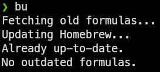
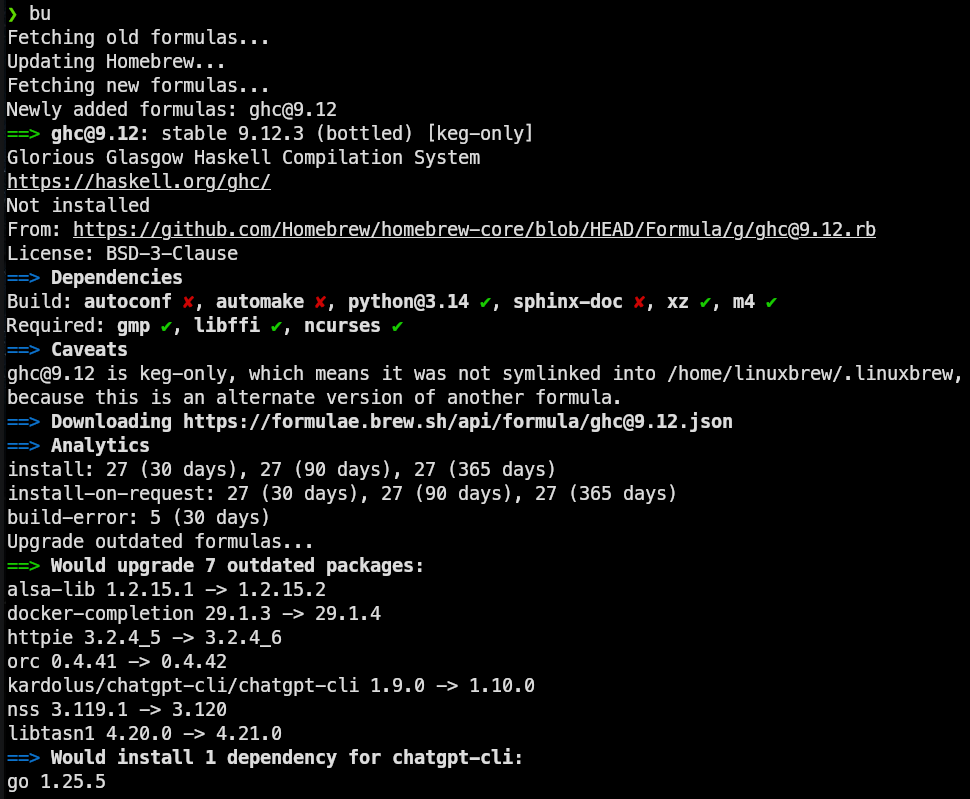

# mikebd's Scripts

A personal collection of small Python tools.

Currently tested only on Linux ([Pop!_OS](https://system76.com/pop/) 22.04).  `brew` commands currently assume formulas
only, cask support for `macOS` may be added in the future.

## Table of Contents

- [Requirements](#requirements)
- [Running scripts](#running-scripts)
- [Available Scripts](#available-scripts)
- [Development](#development)

## Requirements

- Python 3.13+
- [`uv`](https://github.com/astral-sh/uv)

## Running scripts

Scripts are run directly from the repository using `uv`, without installing anything globally.

From the repo root:

```bash
uv run bu
```

To make this convenient from anywhere, add an alias to your `.bashrc` or `.zshrc`:

```bash
alias bu='uv --project $HOME/src/mikebd/py/scripts run bu'
```

## Available Scripts

### Brew Diff (`brew_diff <remote_host>`)

Campares manually installed Homebrew formulas betweel the local and remote hosts.

### Brew Info New Formula (`bu`)

One way I keep track of the evolving developer ecosystem is by paying close
attention to new packages as they become available. This script simplifies that process by
automating the display of `brew info` output for newly added formulas.

Recommended environment variable to prevent implicit updates: `HOMEBREW_NO_AUTO_UPDATE=1`

#### bu Examples

Already up to date:



New formula + outdated packages:



#### bu Inspiration

```bash
#!/bin/bash

old_formulas=$(brew search --formula / | sort)
old_casks=$(brew search --cask / | sort)

brew update

new_formulas=$(brew search --formula / | sort)
new_casks=$(brew search --cask / | sort)

newly_added_formulas=$(comm -13 <(echo "$old_formulas") <(echo "$new_formulas"))
newly_added_casks=$(comm -13 <(echo "$old_casks") <(echo "$new_casks"))

echo "New Formulas:"
echo "$newly_added_formulas" | xargs brew info --formula
echo
echo "New Casks:"
echo "$newly_added_casks" | xargs brew info --cask
```

## Development

### Setup

```bash
uv run pre-commit install
```

### Makefile

A `Makefile` is provided for common development tasks. These commands use `uv` to run `ruff`, `pyright` and `pytest`
within the project environment.

| Command              | Description                                   |
|:---------------------|:----------------------------------------------|
| `make`               | Show the help menu (default)                  |
| `make test`          | Run `pytest` tests with coverage              |
| `make test-parallel` | Run `pytest` tests with coverage, using xdist |
| `make lint`          | Run `ruff` linting checks                     |
| `make typecheck`     | Run `pyright` static type analysis            |
| `make check`         | Run both linting and type checking            |
| `make fix`           | Automatically fix linting issues              |
| `make format`        | Format code with `ruff`                       |
| `make fmt`           | Fix, format, and run all checks (convenience) |
| `make all`           | Run all non-mutating checks                   |
